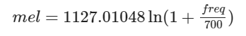

# image-classification-lab

Cмольникова Полина, 
Альперович Вадим,  
17ПМИ

 ---
 
# Введение

 

Главное предположение нашей работы:  **Звук тоже картинка!**.  
Действительно, представив аудиофайл нужным образом, можно свести задачу классификации аудио к задаче классификации изображений. Таким образом, мы решили попробовать создать классификатор двух наших любимых жанров в музыке: ***Классика VS Rap***

# Cбор данных

- Ддя обучающей выборки было собрано (абсолютно легальным образом) 10 классических композиций  и 10 трэков в жанре Rap.
- Вот пример собранных трэков: *Piano Sonata No. 11 in A major K331-K300i, Oxxxymiron - Переплетено, Bagatelle For Piano in A Minor 'Fur Elise', MORGENSHTERN - ICE*

# Препроцессинг

Аудиосигнал обладает различными характеристиками, связанными в первую очередь с его волновой природой, например *частота сигнала*. Однако, также существуют параметры, относящиеся к электронному хранению аудио, форматам и записи, например *sample_rate* - частота дискретизации, т.е. как часто устройство брало отсчеты записываемого сигнала.

Однако, популярным представлением звука является спектограмма. 

Обычная спектрограмма содержит всю ключевую информацию о звуке и строится с помощью оконного преобразования Фурье. Суть этой операции в последовательном применении преобразования Фурье к коротким кусочкам речевого сигнала, домноженным на некоторую оконную функцию. Результат применения оконного преобразования — это матрица, где каждый столбец является спектром короткого участка исходного сигнала. то есть набором множества частот и амплитуд.

#### При чем тут мел?

Эксперименты ученых показали, что человеческое ухо более чувствительно к изменениям звука на низких частотах, чем на высоких. То есть, если частота звука изменится со 100 Гц на 120 Гц, человек с очень высокой вероятностью заметит это изменение. А вот если частота изменится с 10000 Гц на 10020 Гц, это изменение мы вряд ли сможем уловить.

В связи с этим была введена новая единица измерения высоты звука — мел. Она основана на психо-физиологическом восприятии звука человеком, и логарифмически зависит от частоты

Другими словами, на мел-спектрограмме сохраняется больше информации, которая хорошо воспринимается и различается человеком, чем на обычной спектрограмме. Иными словами, такое представление звука больше сфокусировано на низких частотах, и меньше — на высоких.

Параметр `num_mels` отвечает за размер шага при подсчете спектрограммы, рассмотрим его влияние на качество спектрограммы 

# Cэмплирование

 
Важным решением было скачать всего лишь по 10 аудиофайлов для каждого класса, обработать их и разбить каждый трэк на равный отрывки по 15 секунд.
В результате описанных действий мы получили следующие пропорции в наборе данных:
| | Classique | RAP| 
| - | - | - | 
|Train | N = 92|  N = 104 |
| Validate| N = 23 | N = 27|
| Test | N = 70 | N = 70 |

# Своя архитектура NN

# Известная архитектура NN

# Сравнение результатов 

|    | Аrchitecture      |   parameters number |   training time |   validation accuracy |   test f1 |
|---:|:------------------|--------------------:|----------------:|----------------------:|----------------:|
|  0 | our CNN           |              845218 |         52.0352 |                  0.98 |        0.85 |
|  1 | InceptionResNetV2 |            55958850 |        311.132  |                  0.98 |        0.86 |

Посмотрим же на выход с первого сверточного слоя нашей сети:

*Complete Edition Vol. 5 - Serenades and Divertimenti for Wind-010. Divertimento in C, KV 188-240b - Allegro.mp3*

`Input:`

`Output:`

# Примеры классификаций

Посмотрим на то, как предсказывают модели , на разных отрывках трэков:

Эх, Баста, моя игра -  моя игра:

|     | songname        | genre   |   y_test |   part |   y_our_pred |   y_res_pred |   classique_prob |   rap_prob |
|----:|:----------------|:--------|---------:|-------:|-------------:|-------------:|-----------------:|-----------:|
| 122 | Моя игра.mp3_1  | rap     |        1 |      1 |            1 |            1 |             0.01 |       0.99 |
| 123 | Моя игра.mp3_2  | rap     |        1 |      2 |            1 |            1 |             0    |       1    |
| 124 | Моя игра.mp3_3  | rap     |        1 |      3 |            1 |            1 |             0    |       1    |
| 125 | Моя игра.mp3_4  | rap     |        1 |      4 |            1 |            1 |             0    |       1    |
| 126 | Моя игра.mp3_5  | rap     |        1 |      5 |            1 |            1 |             0    |       1    |
| 127 | Моя игра.mp3_6  | rap     |        1 |      6 |            1 |            1 |             0    |       1    |
| 128 | Моя игра.mp3_7  | rap     |        1 |      7 |            1 |            1 |             0    |       1    |
| 129 | Моя игра.mp3_8  | rap     |        1 |      8 |            1 |            1 |             0    |       1    |
| 130 | Моя игра.mp3_9  | rap     |        1 |      9 |            1 |            1 |             0    |       1    |
| 131 | Моя игра.mp3_10 | rap     |        1 |     10 |            1 |            1 |             0    |       1    |
| 132 | Моя игра.mp3_11 | rap     |        1 |     11 |            1 |            1 |             0    |       1    |
| 133 | Моя игра.mp3_12 | rap     |        1 |     12 |            1 |            0 |             0    |       1    |
| 134 | Моя игра.mp3_13 | rap     |        1 |     13 |            1 |            1 |             0    |       1    |
| 135 | Моя игра.mp3_14 | rap     |        1 |     14 |            1 |            1 |             0    |       1    |
| 136 | Моя игра.mp3_15 | rap     |        1 |     15 |            1 |            1 |             0    |       1    |
| 137 | Моя игра.mp3_16 | rap     |        1 |     16 |            1 |            1 |             0    |       1    |
| 138 | Моя игра.mp3_17 | rap     |        1 |     17 |            1 |            1 |             0    |       1    |
| 139 | Моя игра.mp3_18 | rap     |        1 |     18 |            1 |            1 |             0.04 |       0.96 |

Вивальди времена года - действительно классика:

|    | songname                        | genre     |   y_test |   part |   y_our_pred |   y_res_pred |   classique_prob |   rap_prob |
|---:|:--------------------------------|:----------|---------:|-------:|-------------:|-------------:|-----------------:|-----------:|
| 56 | Зима ( Antonio Vivaldi ).mp3_1  | classique |        0 |      1 |            1 |            0 |             0    |       1    |
| 57 | Зима ( Antonio Vivaldi ).mp3_2  | classique |        0 |      2 |            0 |            0 |             0.71 |       0.29 |
| 58 | Зима ( Antonio Vivaldi ).mp3_3  | classique |        0 |      3 |            0 |            0 |             0.95 |       0.05 |
| 59 | Зима ( Antonio Vivaldi ).mp3_4  | classique |        0 |      4 |            0 |            0 |             0.72 |       0.28 |
| 60 | Зима ( Antonio Vivaldi ).mp3_5  | classique |        0 |      5 |            0 |            0 |             0.72 |       0.28 |
| 61 | Зима ( Antonio Vivaldi ).mp3_6  | classique |        0 |      6 |            1 |            0 |             0.4  |       0.6  |
| 62 | Зима ( Antonio Vivaldi ).mp3_7  | classique |        0 |      7 |            1 |            0 |             0.09 |       0.91 |
| 63 | Зима ( Antonio Vivaldi ).mp3_8  | classique |        0 |      8 |            0 |            0 |             0.97 |       0.03 |
| 64 | Зима ( Antonio Vivaldi ).mp3_9  | classique |        0 |      9 |            0 |            0 |             0.94 |       0.06 |
| 65 | Зима ( Antonio Vivaldi ).mp3_10 | classique |        0 |     10 |            0 |            0 |             0.66 |       0.34 |
| 66 | Зима ( Antonio Vivaldi ).mp3_11 | classique |        0 |     11 |            0 |            0 |             0.67 |       0.33 |
| 67 | Зима ( Antonio Vivaldi ).mp3_12 | classique |        0 |     12 |            1 |            1 |             0.2  |       0.8  |
| 68 | Зима ( Antonio Vivaldi ).mp3_13 | classique |        0 |     13 |            1 |            0 |             0.21 |       0.79 |
| 69 | Зима ( Antonio Vivaldi ).mp3_14 | classique |        0 |     14 |            0 |            0 |             0.54 |       0.46 |

[Научно-технический реп](https://www.youtube.com/watch?v=GwDClnIBUIg&t=1s&ab_channel=kawaii_desu_integral) - задача не из легких:

|     | songname                | genre   |   y_test |   part |   y_our_pred |   y_res_pred |   classique_prob |   rap_prob |
|----:|:------------------------|:--------|---------:|-------:|-------------:|-------------:|-----------------:|-----------:|
|  94 | Теорема Лагранжа.mp3_1  | rap     |        1 |      1 |            1 |            0 |             0    |       1    |
|  95 | Теорема Лагранжа.mp3_2  | rap     |        1 |      2 |            1 |            1 |             0.24 |       0.76 |
|  96 | Теорема Лагранжа.mp3_3  | rap     |        1 |      3 |            1 |            1 |             0.01 |       0.99 |
|  97 | Теорема Лагранжа.mp3_4  | rap     |        1 |      4 |            1 |            1 |             0    |       1    |
|  98 | Теорема Лагранжа.mp3_5  | rap     |        1 |      5 |            1 |            1 |             0    |       1    |
|  99 | Теорема Лагранжа.mp3_6  | rap     |        1 |      6 |            1 |            1 |             0    |       1    |
| 100 | Теорема Лагранжа.mp3_7  | rap     |        1 |      7 |            1 |            1 |             0    |       1    |
| 101 | Теорема Лагранжа.mp3_8  | rap     |        1 |      8 |            1 |            1 |             0    |       1    |
| 102 | Теорема Лагранжа.mp3_9  | rap     |        1 |      9 |            1 |            1 |             0    |       1    |
| 103 | Теорема Лагранжа.mp3_10 | rap     |        1 |     10 |            1 |            1 |             0.01 |       0.99 |
| 104 | Теорема Лагранжа.mp3_11 | rap     |        1 |     11 |            1 |            1 |             0    |       1    |
| 105 | Теорема Лагранжа.mp3_12 | rap     |        1 |     12 |            1 |            1 |             0    |       1    |
| 106 | Теорема Лагранжа.mp3_13 | rap     |        1 |     13 |            1 |            1 |             0    |       1    |
| 107 | Теорема Лагранжа.mp3_14 | rap     |        1 |     14 |            1 |            0 |             0.01 |       0.99 |

И самая сложная задача, исполненная великим комбинатором собственного сочинения песня [стоит послушать!](https://www.youtube.com/watch?v=W33ldaidcRc&ab_channel=%D0%92%D0%BE%D0%B2%D0%B0%D0%9A%D0%B0%D0%B7%D0%B0%D0%BD%D1%86%D0%B5%D0%B2):

|     | songname                             | genre   |   y_test |   part |   y_our_pred |   y_res_pred |   classique_prob |   rap_prob |
|----:|:-------------------------------------|:--------|---------:|-------:|-------------:|-------------:|-----------------:|-----------:|
| 108 | Сергей Мавроди   Горе не беда.mp3_1  | rap     |        1 |      1 |            1 |            0 |             0.04 |       0.96 |
| 109 | Сергей Мавроди   Горе не беда.mp3_2  | rap     |        1 |      2 |            0 |            0 |             0.94 |       0.06 |
| 110 | Сергей Мавроди   Горе не беда.mp3_3  | rap     |        1 |      3 |            0 |            1 |             0.87 |       0.13 |
| 111 | Сергей Мавроди   Горе не беда.mp3_4  | rap     |        1 |      4 |            0 |            1 |             0.86 |       0.14 |
| 112 | Сергей Мавроди   Горе не беда.mp3_5  | rap     |        1 |      5 |            0 |            0 |             0.99 |       0.01 |
| 113 | Сергей Мавроди   Горе не беда.mp3_6  | rap     |        1 |      6 |            0 |            0 |             0.95 |       0.05 |
| 114 | Сергей Мавроди   Горе не беда.mp3_7  | rap     |        1 |      7 |            0 |            0 |             0.99 |       0.01 |
| 115 | Сергей Мавроди   Горе не беда.mp3_8  | rap     |        1 |      8 |            0 |            0 |             0.82 |       0.18 |
| 116 | Сергей Мавроди   Горе не беда.mp3_9  | rap     |        1 |      9 |            0 |            0 |             0.97 |       0.03 |
| 117 | Сергей Мавроди   Горе не беда.mp3_10 | rap     |        1 |     10 |            0 |            1 |             0.81 |       0.19 |
| 118 | Сергей Мавроди   Горе не беда.mp3_11 | rap     |        1 |     11 |            0 |            1 |             0.91 |       0.09 |
| 119 | Сергей Мавроди   Горе не беда.mp3_12 | rap     |        1 |     12 |            0 |            0 |             0.9  |       0.1  |
| 120 | Сергей Мавроди   Горе не беда.mp3_13 | rap     |        1 |     13 |            0 |            0 |             0.95 |       0.05 |
| 121 | Сергей Мавроди   Горе не беда.mp3_14 | rap     |        1 |     14 |            0 |            0 |             0.95 |       0.05 |

# Заключение

Классика никогда не станет репом, а вот реп уже стал классикой...
